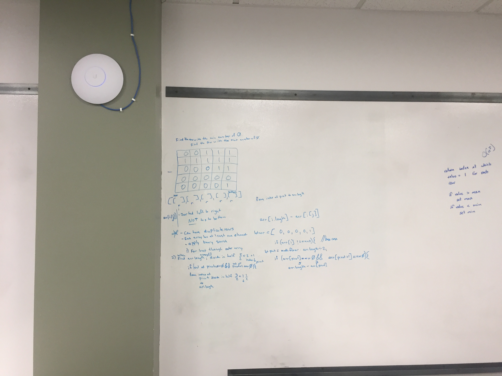

# Challenge Summary

Code Challenge 36

## Challenge Description

Given a 2D array where the rows are sorted and contain only 0 and 1. Return the index of the row with the biggest amount of zeroes, and the index of the row with the biggest amount of zeroes.

## Approach & Efficiency

Use a binary search of the array to avoid a search time of n^2 (n squared).

## Solution

