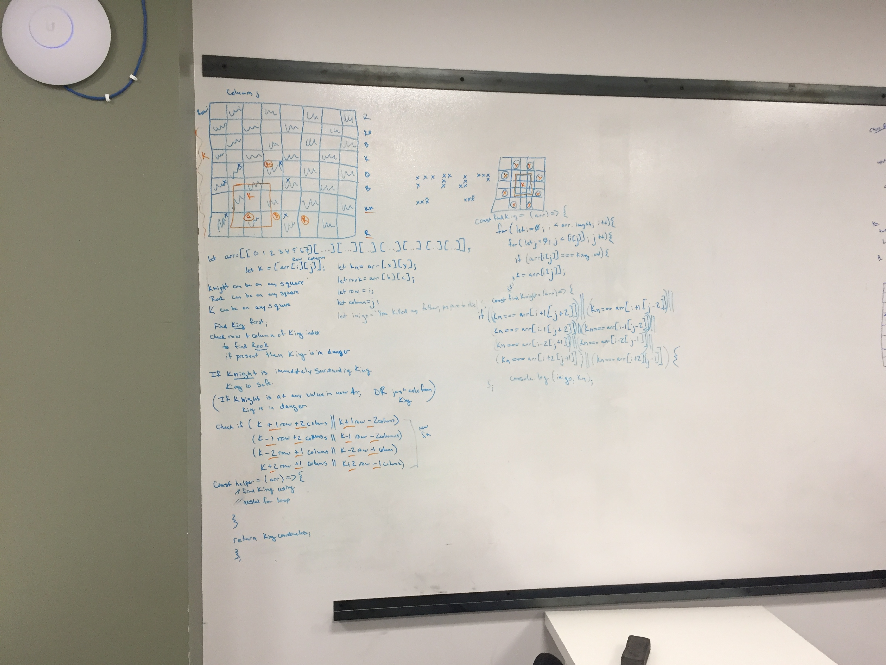

# Challenge Summary
Code Challenge 38

## Challenge Description
Check if a given chess board (given as a 2D Array) is in a checkmate state. Available players are knight, rook, and king.

## Approach & Efficiency
Wrote three separate functions to find each player. 

For the first function findK, using a nested for loop, find the coordinates of the king. 

For the second, findKn, leverage the coordinates of the king, check to see if a knight is present at any combination of two rows up or down and over left or right by one OR any combination of one row up or down and over left or right by two. 

For the third, findRook, leverage the coordinates of the king, and check to see if a rook exists within either the same row or column as the king. 

Time and space complexity is assumed to be O(n^2) where n represents each cell to locate the king.

## Solution

