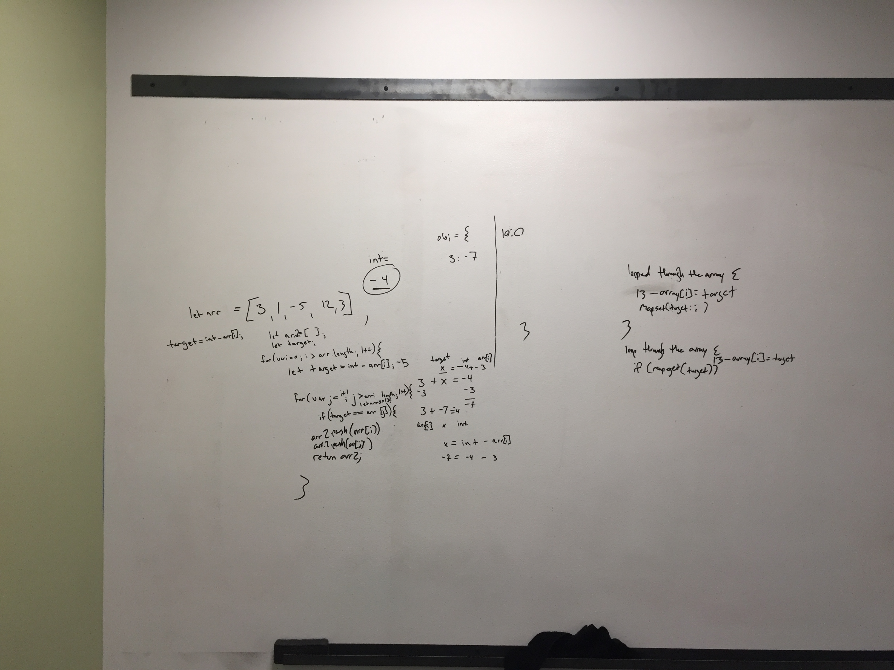

# Challenge Summary
Code Challenge 28

## Challenge Description
Problem Domain: Given an array of integers and a value, find a pair of integers in the array that add to that value.

## Approach & Efficiency
Find the target value associated with each element in an array that equals the provided integer, then store and compare those values against all values in the given array. 

## Solution
;