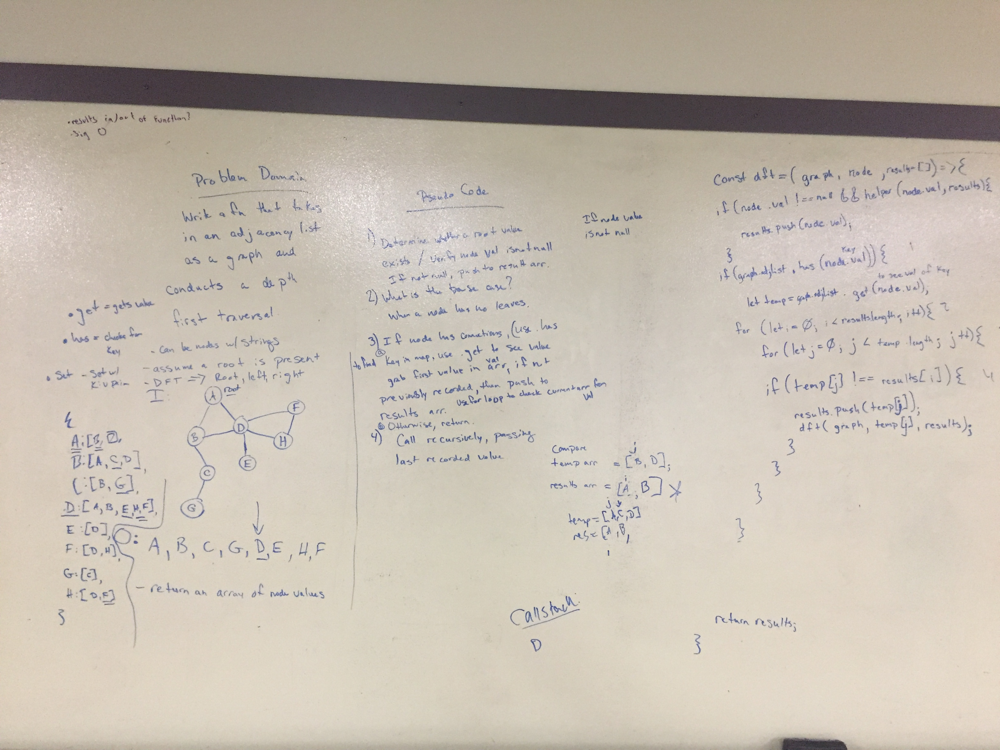
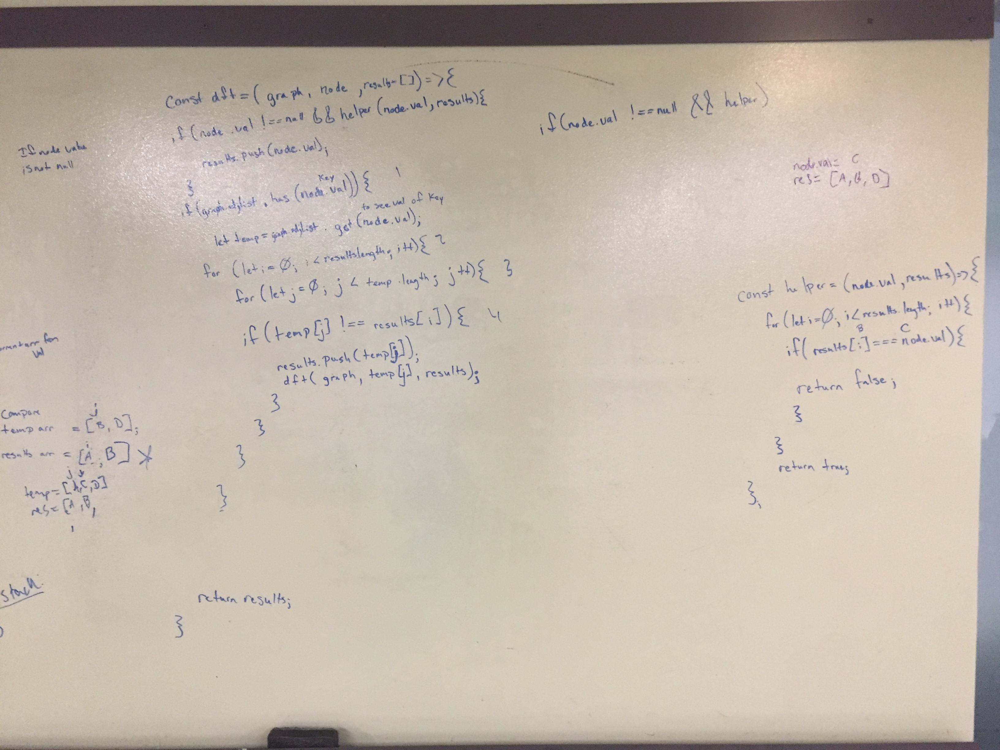

# Challenge Summary
Code Challenge 41

## Challenge Description
Conduct a depth first preorder traversal on a graph. Create a function that accepts an adjacency list as a graph, and conducts a depth first traversal. Without utilizing any of the built-in methods available to your language, return a collection of nodes in their pre-order depth-first traversal order.

## Approach & Efficiency
Determine whether root value exists. If the value is not null, push to a results array. The base case is where a node has no leaves/connections. If node has connections, use .has to find the key in the map, use .get to see the value associated with the key (an array). Set to a temp variable. If not previously recorded, push to results array. Otherwise return. Call recursively, passing last recorded value.

## Solution

