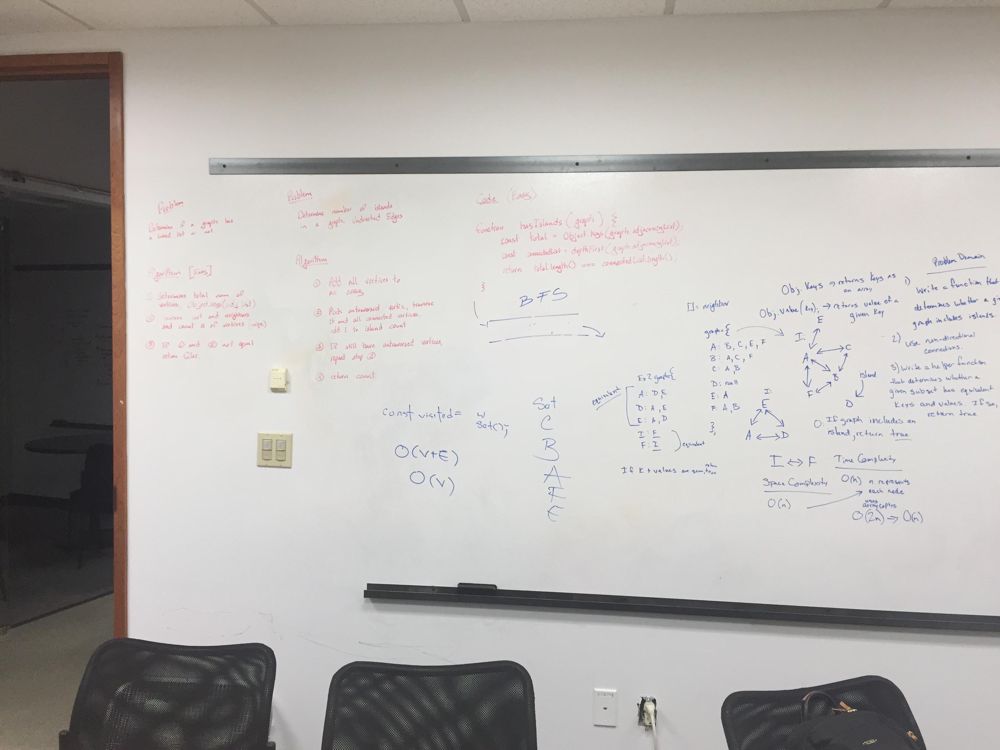

# Challenge Summary
Code Challenge 42

## Challenge Description
Given a graph. Determine if there are islands in the graph.  Stretch goal: Return the island count.

## Approach & Efficiency
Assume connections are non-directional (both ways).

## Solution
