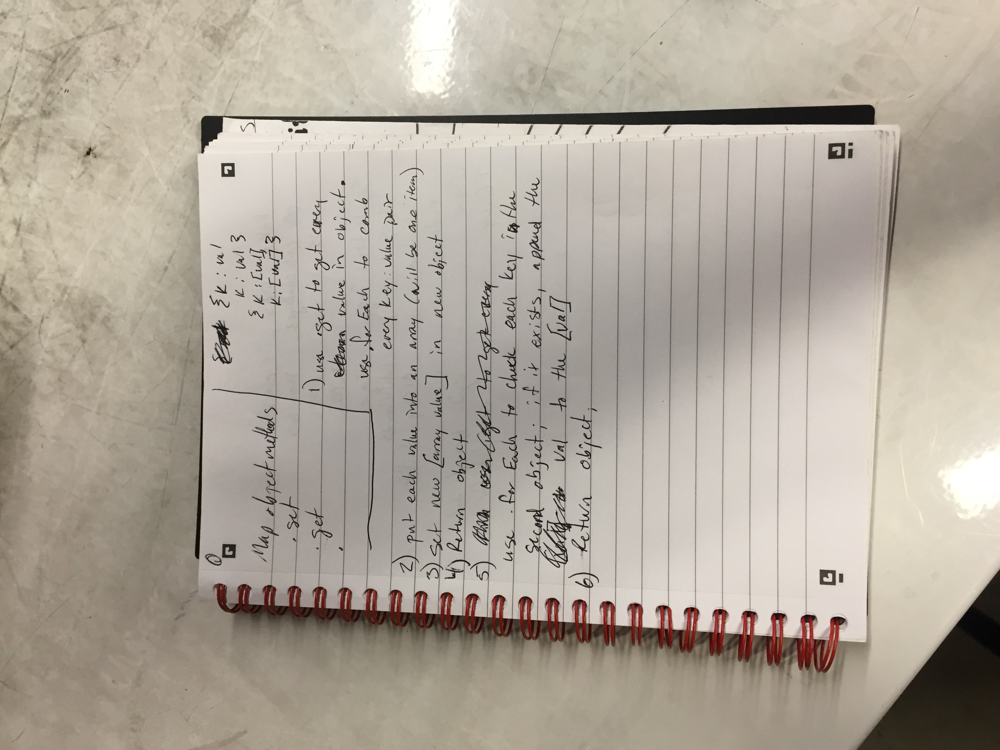
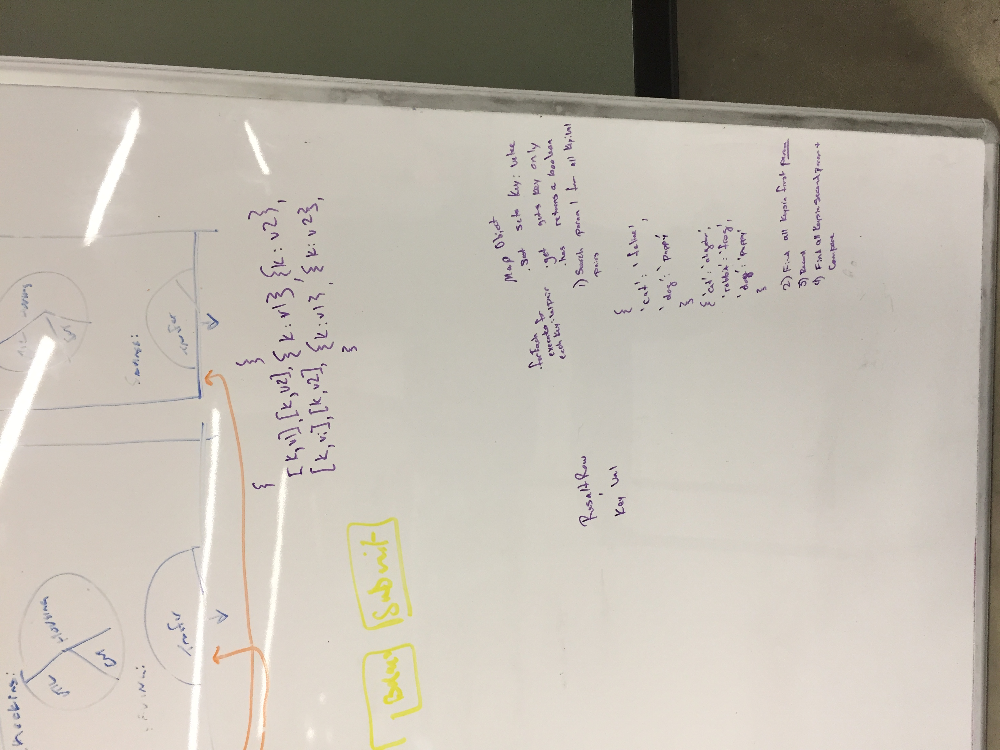

# Challenge Summary
Code Challenge 33

## Challenge Description
Write a function that LEFT JOINs two hashmaps into a single data structure.
The first parameter is a hashmap that has word strings as keys, and a synonym of the key as values.
The second parameter is a hashmap that has word strings as keys, and antonyms of the key as values.
Combine the key and corresponding values (if they exist) into a new data structure according to LEFT JOIN logic.
LEFT JOIN means all the values in the first hashmap are returned, and if values exist in the “right” hashmap, they are appended to the result row. If no values exist in the right hashmap, then some flavor of NULL should be appended to the result row.
The returned data structure that holds the results is up to you. It doesn’t need to exactly match the output below, so long as it achieves the LEFT JOIN logic.
Avoid utilizing any of the library methods available to your language.

## Approach & Efficiency
1. Use Object.keys to find every value in the first object
2. Store each key:value pair in a new object, putting each value into an array (will be one item this first time)
3. Return the object
4. Use .forEach to check each key in the second object; if it exists, append the value to the [value array]
5. Return object

**OR more simply:**

 Object.keys(leftMap).forEach(key => {
    // ALL YOUR OPERATIONS
    // Make the leftValue into an array
    // Push/Append/Concat the values in the right if present
    // Add the key/value pair to the result
 });

## Solution

