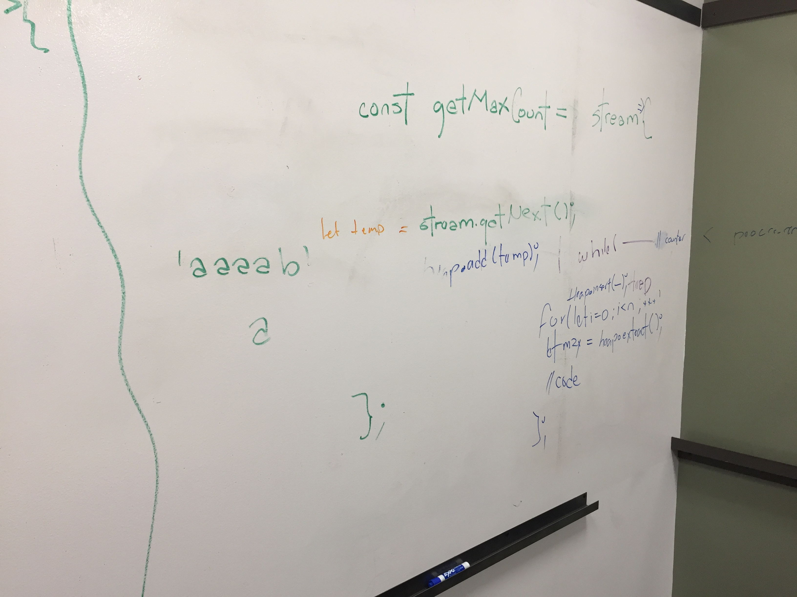
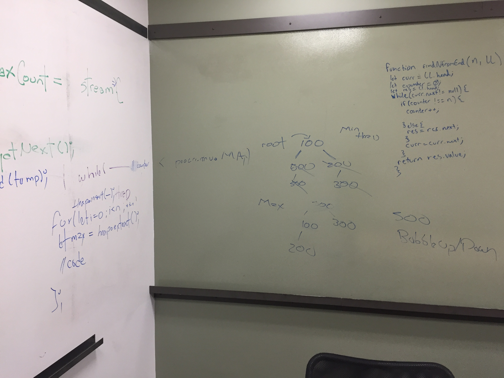
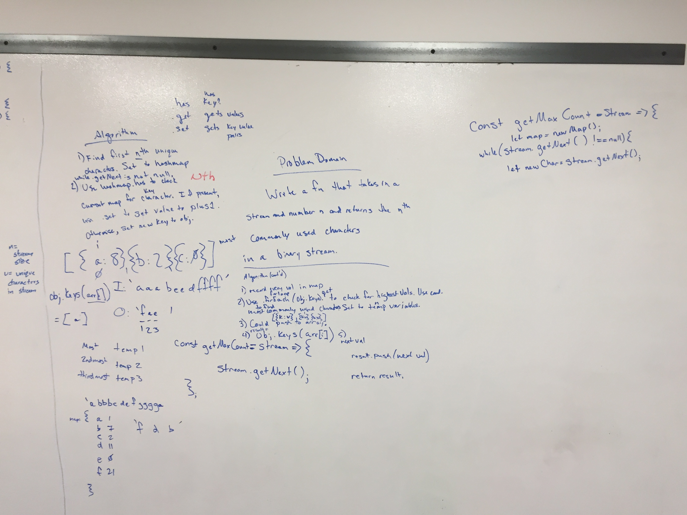

# Challenge Summary
Code Challenge 43

## Challenge Description
Write a function that takes in a binary stream of indefinite length, and a number, n, and returns the nth most commonly used characters.

## Approach & Efficiency
Used to push interviewer to think about efficiency, outside of the box, ensuring user experience isn't hindered. For example, if stream is indefinite, control its length as a parameter by designating a counter. Can record this value in a .env file.

## Solution

