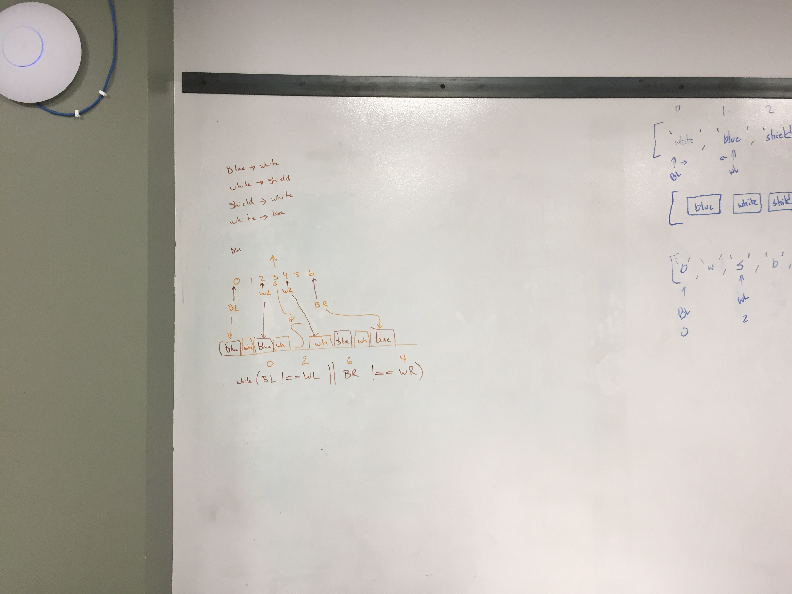
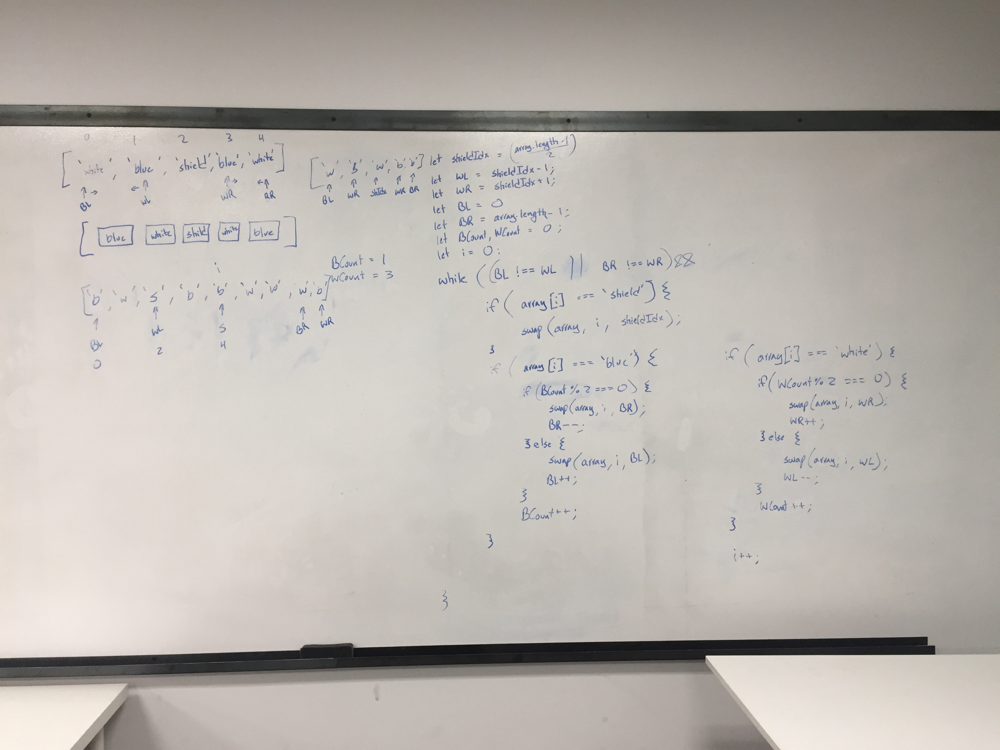

# Challenge Summary
Code Challenge 37 - Salvadoran Flag

## Challenge Description
Given an array containing only an unspecified amount of the following strings:

"Blue"

"White"

and a single string "Shield". Mutate the array to resemble the Salvadoran flag.

## Approach & Efficiency
Quick sort and partition method.

## Solution

